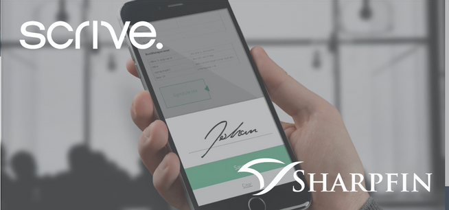

Scrive eSign is seamlessly integrated in Sharpfin’s cloud-based Wealth Management suite and Advisory Service workflows.
It makes it easier to sign agreements and onboard customers who can sign anywhere, on any device.
It helps pension fund advisors and wealth managers to eliminate time-consuming admin tasks as well as speeding up the process while providing a premium customer experience.
It also lowers the overall cost of having an external solution for digital signatures.

Sharpfin has a history of using better technology to support customers and the wealth management community with solutions that continuously are enhanced and gives a better user experience while offering a competitive cost structure compared to the incumbent vendors.
“By selecting Scrive as a partner, Sharpfin made sure to give customers the best signature technology available that makes the customer identities undeniable”, says Markus Alin, CEO, Sharpfin.
“It is instrumental for Sharpfin to provide the industry with secure digital alternatives when the physical meeting is more and more moving into a digital world.”

“Scrive’s mission is to simplify the way customers meet and do business in a digital world, and for us it felt natural to collaborate with Sharpfin.
Together we have created a solution which is both secure, efficient and gives the wealth management industry time to focus on their core business”, says Viktor Wrede, CEO, Scrive.

Scrive and Sharpfin have a partnership agreement and have already taken measures to deepen the cooperation by use of Scrive’s eID Hub for secure electronic identification.

** For further information:  **

*Matilda Skagerberg,*

Marketing Coordinator Sweden, Scrive,

tel. +46 79 102 93 33,

e-post: matilda.skagerberg@scrive.com

--

*Markus Alin,*

CEO, Sharpfin,

Tel +46 70 840 41 00

