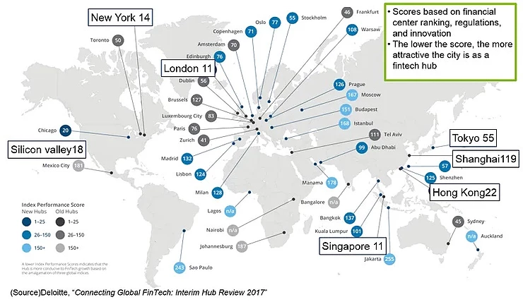

För inte så längesen låg Stockholm på andra plats över attraktiva fintechstäder i Europa enligt en rapport från Stockholms Stad publicerad 2015. I rapporten kallades även Stockholm för “Europe’s unicorn factory” efter succéerna med fintechbolagen Klarna, iZettle och Trustly med flera. Några år senare, under 2017, kartlade Deloitte hur attraktiva städer världen över var som fintech-hubbar. Enligt denna kartläggning var Stockholm inte längre topp tre. Istället landade vi nu på fjärde plats i Europa, tätt följt av Dublin (se bild). Topp tre var London, Zürich och Frankfurt.

Tyvärr tycks den nedåtgående trenden hålla i sig. Medan fintech fullkomligt exploderar världen över, särskilt i Kina och USA, ligger Sverige hela tiden något steg efter. Detta trots att vi är ett teknologiskt avancerat i-land med god ekonomi och alla förutsättningar för att återta silvermedaljen i Europa. Särskilt inom kapitalförvaltningsbranschen ligger digitaliseringen smärtsamt efter, och bakom hemsidornas vässade yta görs mycket dokumentering manuellt eller i Excel.

Vad är det då som gör att Sverige släntrar efter trots rätt förutsättningar? Om vi ser till Kina – som för ett par år sedan basunerade om hur de siktade på att bli marknadsledande inom fintech globalt – tycks svaret ligga i bristande samarbete med landets finansiella institutioner. För att möjliggöra att Kina ska bli nummer ett på fintech har två av landets största banker, China Development Bank och statligt ägda People’s Bank of China, gått in med stora finansiella och teknologiska satsningar för att stötta landets utveckling. Bland annat investerar China Development Bank kraftigt i utvecklingen av blockchainteknologi medan People’s Bank of China satsat på att ta fram sin egen kryptovaluta. Allmänt är alternativa betalningssätt långt mer populärt i Kina än i många andra länder, särskilt mobila betalningar. Enligt en studie från 2018 använde nittiotvå procent av kineser mobilen för att genomföra köp. I Kina satsar de på att digitalisera hela finansbranschen och dess processer från ax till limpa – för att göra det lättare för både kunder och kapitalförvaltare att maximera avkastning. Om fler krångliga manuella processer kan digitaliseras kan man spara både tid och pengar; något som de tycks ha insett i Kina och USA men inte i Sverige.

En kinesisk betalningsmetod jag dock inte önskar tas till Sverige är den som implementerats med hjälp av Kinas avancerade teknologi för ansiktsigenkänning. Med den behöver du endast le mot kameran i en butik för att din betalning ska registreras (något som förhoppningsvis inte kommer komma till Sverige tack vare spännande fintechbolaget Indivd, som vi kommer att skriva mer om inom kort).

I kontrast till Kina drivs Sveriges finansiella institutioner fortfarande av en konservativ rädsla för förändring. Många kapitalförvaltare försöker även uppfinna hjulet internt istället för att samarbeta med den mängd nya fintechbolag som uppkommit bara de senaste åren. Det är dags för Sverige att inse det som världens stora spelare redan insett: fintechbolag och finansiella institutioner är inte konkurrenter – vi spelar i samma lag. Vi vill alla använda den nya teknologin och möjligheterna som open banking innebär för att förenkla och förbättra landets finansiella transaktioner. Om vi vill bana väg för en hållbar, teknologiskt avancerad ekonomi, med appar och betalningsmedel som är lättanvända på det sätt användarna kräver, är det dags att ta steget in i framtiden. Den är trots allt redan här.