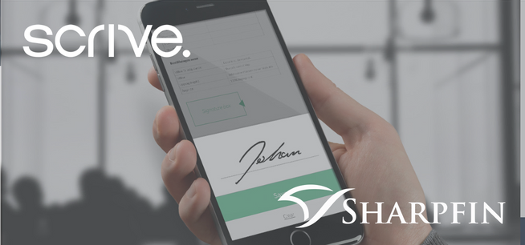

Genom partnerskapet mellan Sharpfin och Scrive erbjuds värdepappersbolag en SaaS-lösning som kraftigt eliminerar tidskrävande administratörsuppgifter samtidigt som det ger en smidig och helt digital kundupplevelse. För kunden som tar emot dokumenten innebär detta en större närhet till sina rådgivare, viktigt inte minst i en omvärld där en digital arbetsplats och möten på distans har blivit det nya normala. Den nya lösningen gör det enkelt att signera och distribuera dokument till kund samtidigt som det ger både tid och kostnadsbesparingar för värdepappersbolaget.

Sharpfin har en tradition av att använda djup teknisk kunskap för att skapa värde och ge bättre användarupplevelse till kunder, samtidigt som de erbjuder en konkurrenskraftig kostnadsstruktur jämfört med många andra leverantörer. ”Genom att välja Scrive som partner säkerställer Sharpfin att kunderna får den bästa tekniken för elektroniska underskrifter som finns tillgänglig, och som gör kundens identitet obestridlig”, säger Markus Alin, VD för Sharpfin. ”Det är essentiellt för Sharpfin att förse branschen med säkra digitala alternativ när fysiska möten mer och mer rör sig in i den digitala världen.”

”Scrives uppdrag är att på ett smidigt och säkert sätt göra det enklare att mötas online och göra affärer i en digital världoch för oss kändes det naturligt att samarbeta med Sharpfin. Tillsammans har vi skapat en lösning som är både säker och effektiv, och som ger kapitalförvaltningsbranschen tid att fokusera på sin kärnverksamhet”, säger Viktor Wrede, VD för Scrive.

Scrive och Sharpfin har sedan en tid tillbaka ett partnerskapsavtal och har redan fördjupat samarbetet ytterligare med ett avtal avseende Scrives eID Hub för säker elektronisk identifiering i Sverige och andra anslutna länder.

**För ytterligare information:**

Matilda Skagerberg, Marknadskoordinator Sverige, Scrive, tel. +46 79 102 93 33, e-post: matilda.skagerberg@scrive.com

Markus Alin, VD, Sharpfin, tel +46 70 840 41 00, e-post: markus@sharpfin.com