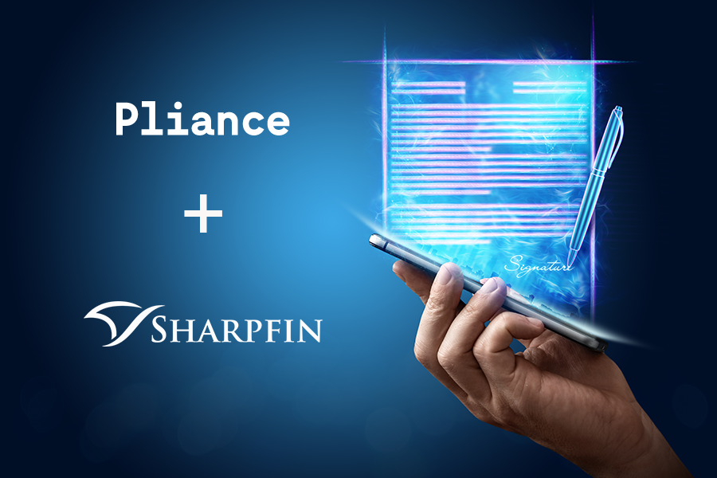

import PersonContact from '../components/PersonContact'

Pliance offers a state-of-the-art solution for screening anti-money laundring (AML) sanction lists, lists with politically exposed persons (PEP) and lists of beneficiary owners. By utilizing Pliance solution, wealth managers can have the comfort that their register of private clients and company relations (e.g. beneficial owners) are constantly screened and that they get a notification real-time about any potential compliancy breaches.

Sharpfins’ Wealth Management Suite is a SaaS-solution used by an increasing number of clients throughout Europe with the objective to increase efficiency in the wealth management industry. “For us, it was a natural next step to integrate Pliance solution.”, says Markus Alin, CEO, Sharpfin. “This empowers our customers with a service that simplifies advanced monitoring in their daily operations and ensures that they are compliant with AML and PEP regulations, and at the same time provides a fully digital workflow that saves them a lot of time.”

“Pliance mission is to make PEP and AML screening easy and an integrated, automatic part of your daily business. With Sharpfin we have found an ideal partner to scale this solution to many wealth managers at once. Our joint, subscription-based offering gives the customer an immediate return of investment.”, says Siam Choudhury, CEO, Pliance.

_For further information:_

<PersonContact name={"Siam Choudhury"} title={"CEO Pliance"} email={"siam@pliance.io"} phone={"+46 70-344 96 73"} />
<PersonContact name={"Markus Alin"} title={"CEO Sharpfin"} email={"markus@sharpfin.com"} phone={"+46 70 840 41 00"} />

** About Sharpfin **

Sharpfin is the ambitious challenger providing a cloud based powerful solution built on better technology for the financial community in the areas of wealth management. Sharpfins competitive edge lies in the depth of knowledge of wealth management and how to do it with better technology.

Sharpfins customer include successful niche banks, wealth management firms and family offices across the European region. Sharpfin provides sales and quality support services from its head quarter located in Stockholm.

www.sharpfin.com

https://www.linkedin.com/company/sharpfin-ab

** About Pliance **

Pliance is a Stockholm-based company founded by experienced tech entrepreneurs and engineers. We value modern technologies and approaches in creating products to help simplify and automate AML processes for companies world wide. Our mission is to help customers combat financial crime and.

www.pliance.io

https://www.linkedin.com/company/pliance/

