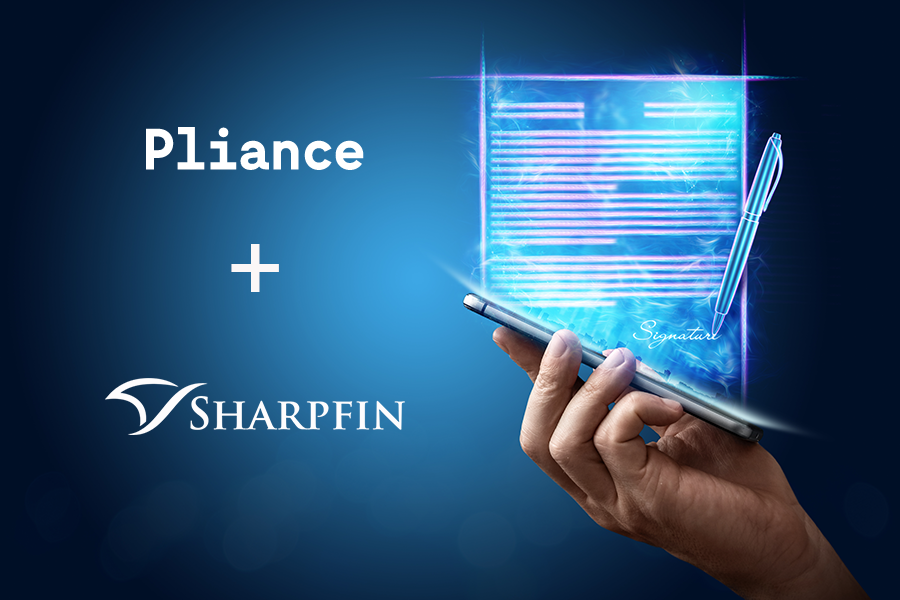

import PersonContact from '../components/PersonContact'

Pliance tillhandahåller en modern lösning för att på daglig basis kontrollera kundregister mot penningtvätt, sanktionslistor, personer i utsatt politisk ställning (PEP) samt huvudmannaregister för bolag. Genom att använda Pliance API-baserade lösning, kan företag inom den finansiella sektorn säkerställa att deras kundstock hela tiden efterlever gällande lagstiftning. Relationer (t.ex. verkliga huvudmän) för företagskunder kontrolleras löpande mot register och flaggas upp i realtid för avvikelser. Detsamma gäller om någon kund skulle dyka upp på register för personer i utsatt politisk ställning eller sanktionslistor för penningtvätt.

Sharpfins molnbaserade lösning, Wealth Management Suite, används av ett ständigt ökande kunder i hela Europa och bolaget har med sin lösning ambitionen att effektivisera branschen genom att tillhandahålla ett heltäckande system för all nödvändig funktionalitet. “För oss var det ett naturligt nästa steg att implementera Pliance lösning.”, säger Markus Alin, VD, Sharpfin. “Det ger våra kunder tillgång till avancerad funktionalitet för kontroll av sitt kundregister i Sharpfin och säkerställer att de efterlever gällande lagstiftning avseende penningtvätt samtidigt som det sparar enormt mycket tid jämfört med att göra kontrollerna manuellt.”

“Pliance mål är att göra penningtvättskontroller enkla och en integrerad del av din dagliga affär. Med Sharpfin har vi hittat en ideal leverantör för att skala vår lösning och nå ut till många förmögenhetsförvaltare samtidigt. Vår gemensamma abonnemangsmodell gör det också mycket kostnadseffektivt. Kunderna får en omedelbar återbetalning på investeringen.”, säger Siam Choudhury, VD, Pliance.

_För mer information:_

<PersonContact name={"Siam Choudhury"} title={"VD Pliance"} email={"siam@pliance.io"} phone={"+46 70-344 96 73"} />
<PersonContact name={"Markus Alin"} title={"VD Sharpfin"} email={"markus@sharpfin.com"} phone={"+46 70 840 41 00"} />

** Om Sharpfin **

Sharpfin är en ambitiös utmanare som tillhandahåller en kraftfull molnbaserad lösning utvecklad med bättre teknologi för kapitalförvaltare. Sharpfins konkurrensfördel ligger i en djupgående kunskap inom kapitalförvaltning och hur man effektiviserar denna med bättre teknik.

Sharpfins kunder inkluderar framgångsrika nischbanker, kapitalförvaltningsbolag och familjekontor (family office) i hela den europeiska regionen. Sharpfin tillhandahåller försäljning och högkvalitativa supporttjänster från sitt huvudkontor i Stockholm.

www.sharpfin.com

https://www.linkedin.com/company/sharpfin-ab

** Om Pliance **

Pliance är ett modernt AML-verktyg for att efterleva penningtvättsregelverk och motverka finansiell kriminalitet. Bolaget är grundat av entreprenörer med bakgrund från fintech, och lösningen hjälper företag att fokusera på sin kärnverksamhet samtidigt som man säkerställer en automatiserade, skalbara och tillförlitliga AML rutiner. Pliance är baserat i Stockholm med kunder i Europa.

www.pliance.io

https://www.linkedin.com/company/pliance/

