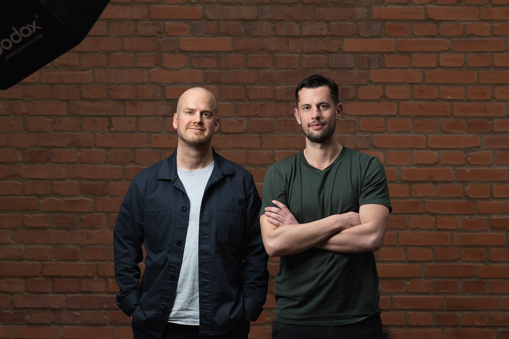

_Daniel Eneroth, medgrundare, och Olof Cristoferson, medgrundare och vd, Fondo._

Fondo är en nystartad sparplattform och app som kan halvera kundernas fondavgifter genom att sälja fonder till inköpspris. Bolaget har själva byggt appen och tekniken bakom, vilket gör att de kan erbjuda tjänsterna till ett lägre pris utan dyra mellanhänder. Entreprenören Olof Cristoferson grundade bolaget 2019 till följd av att han såg ett behov på marknaden av en oberoende fondplattform som fokuserar renodlat på distribution av fonder.

– Under min tid på SEB och sen EY jobbade jag mycket med fonddistribution och såg hur mycket av fondavgiften som går till distributionstjänster. Det är fullt rimligt att betala en avgift för själva fondförvaltningen, men distributionen kan göras betydligt mer kostnadseffektiv med hjälp av modern digital teknik, menar Olof.

** Svenskar är sparare i världsklass **

Olof bestämde sig att tillsammans med partners skapa den moderna och digitala distributionsplattform han själv saknade på marknaden. Det var viktigt för grundarna att bolaget skulle ha sitt eget värdepapperstillstånd, och Fondo står under tillsyn av Finansinspektionen. De erbjuder därigenom sina kunder samma insättningsgaranti och investerarskydd som de får hos andra svenska banker och värdepappersbolag.

– Svenskarna är världsmästare på att fondspara; just nu har vi 6 000 miljarder kronor i fonder som förvaltas av olika aktörer. Vi vill uppmuntra svenskarna i sitt sparande genom att göra det ännu mer lönsamt att fondspara. Vi gör det tydligt för kunderna vilka kostnader som går till förvaltning och vilka som går till distribution, och på så vis kan vi konkurrensutsätta distributionen mer och trycka ner priserna rejält.

** Smidiga system med minimal administration **

På Sharpfin har vi talat oss varma kring hur viktigt det är med en fortsatt digitalisering av kapitalförvaltningsbranschen, där många förvaltare fortfarande sitter låsta i gamla manuella processer som inte passar dagens digitala värld. Fondo har likt Sharpfin hittat en lösning på  detta problem genom att bygga sin egen teknik från grunden.

– Många stora aktörer inom kapitalförvaltning har funnits i många år, sedan förra seklet och ofta längre. Det innebär att det finns mycket arv; mycket legacysystem som är svåra att förnya och bygga på med dagens teknik. Därför kan många fastna i manuella administrationsprocesser som stjäl tid från huvudsyftet med bolaget: förvaltning.

Olof fortsätter:

– Vi försöker tänka långsiktigt i utvecklingen av vår teknik, såsom vår app och våra gränssnitt, genom att bygga en arkitektur som enkelt kan moderniseras och där vi kan implementera ny teknik när den blir tillgänglig. Den digitala utvecklingen går oerhört fort och det gäller att inte bara hänga med idag – man måste även hålla sig relevant i framtiden.

Sharpfins Wealth Management Suite är helt fristående och fungerar som ett modernt flexibelt lager på gamla legacysystem, vilket innebär att även mer konservativa finansbolag kan digitalisera sina administrationsprocesser utan att man måste reformera hela sin IT.

– För varje extra timme i veckan förvaltare kan fokusera på förvaltning istället för administration skapas både arbetsglädje och bättre avkastning. Det är en väldigt bra deal för både slutkund och förvaltare. Både Sharpfin och Fondo ser en spännande framtid inom digital kapitalförvaltning – och vi är väl positionerade att möta den.
